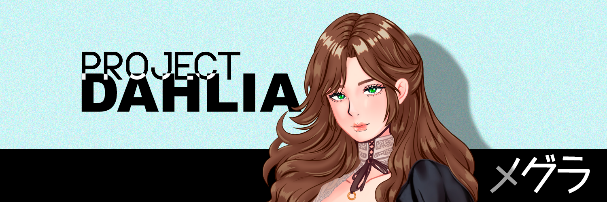

# ⚔ Messinia Graciene

<figure><figcaption></figcaption></figure>

Blockchain technology has transformed the way we exchange value and interact with each other. However, the lack of interoperability between different blockchain networks has been a major hindrance in achieving the full potential of this technology.

**Messinia Graciene: Project DAHLIA** is a project that aims to be the leading platform for blockchain gaming, providing players with a wide range of options and opportunities to participate in the ecosystem. We envision a future where blockchain technology is widely adopted and integrated into the gaming industry, and we are committed to leading the way in this exciting and rapidly evolving field.

Here are some key points about the project:

* The project is built on NEAR Protocol's blockchain technology and offers an interactive storytelling experience.
* Messinia Graciene or Megura has a collection of 5656 NFTs that are tied to the project's narrative.
* The project includes an all-rounder Discord bot named "Dahlia" that offers features like verification/captcha, RPG progression, and server utilities through slash commands and Discord interactions. It also serves as a storyteller for a text-based RPG where players can participate in PvE and PvP encounters.
* Dahlia is designed to run without Discord privileged gateway intents. She does not scan normal message content, presence activity, or the full server member list.

In this whitepaper, we'll take a closer look at Megura's mission, features, and the technology behind it. We'll also explore how the project aims to create an open and collaborative community across different blockchain networks. The whitepaper is subject to change as the project continues to evolve, so stay tuned for updates.
