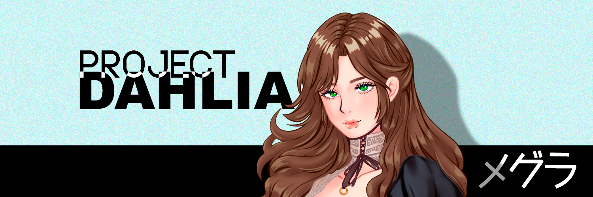

# ⚔ Messinia Graciene

<figure><figcaption></figcaption></figure>

**Messinia Graciene: Project DAHLIA** is a text-based role-playing game played entirely inside Discord. Players create a voyager, fight monsters, duel each other, join one of two rival factions and follow an unfolding story across the realm of Eldelvain.

Here are some key points about the project:

* The game is told through **Dahlia**, an all-rounder Discord bot. She is the storyteller, and she also runs verification (captcha), giveaways, raffles, tickets, forms, button roles, scheduled posts and other server utilities through slash commands and buttons.
* Progress is measured in levels, gear and **IURA**, the in-game currency. IURA is earned and spent only inside the game.
* Players fight monsters (PvE), duel and brawl other players (PvP), complete daily and weekly quests and compete for their faction in weekly standings.
* Dahlia is designed to run without Discord's privileged gateway intents. She does not scan normal message content, presence activity or the full server member list.

These pages cover the story, the features and how to set up and play the game. They change as the game grows, so check back for updates.
