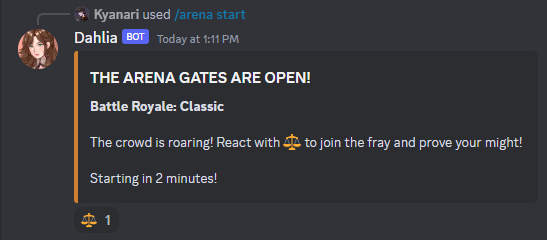

# /arena

<figure><figcaption></figcaption></figure>

The **/arena** command is a fun and interactive way to engage in virtual battles right within your Discord server. Whether you're a server member looking to join the fray or an admin wanting to set up a new event, this guide will walk you through all the steps.

### Basic Usage

To use the `/arena` command, simply type `/arena` in the chat and Discord will show you the available subcommands and options. The primary subcommands are:

* `/arena start`: To join an arena event.
* `/arena boss`: To toggle the boss feature.
* `/arena rules`: To view the game rules.

#### _Starting an Arena Event_

To start an arena event, use the following command:


```javascript
/arena start
```


Optional Parameters:

* `timer`: Set the timer for the event in minutes. Choices are 3, 5, or 7 minutes. Default is 2 minutes.
* `mode`: Choose the PvP mode for the event. Available modes include Classic, Evolving Classic, Evolving Deathmatch, Deathmatch, Most Wanted, and Free For All.

Modes:

* Battle Royale: Classic (All base stats, no respawn)
* Battle Royale: Evolving (All base stats with % chance to respawn)
* Battle Royale: Evolving Deathmatch (Current stats with % chance to respawn)
* Battle Royale: Deathmatch (Current stats, no respawn)
* Battle Royale: Most Wanted (One player will be buffed for everyone to defeat)
* Battle Royale: Free For All (Participants will defeat players within time limit. Most kills win.)


Players need to have a voyager profile to participate. They can create one with `/start` command.


#### _Adding a Boss to the Arena_

To toggle the boss feature on or off, use:

```javascript
/arena boss
```

Optional Parameters:

* `show`: Choose whether to show the boss or not.

#### _Viewing the Rules_

To view the rules of the arena, simply type:

```javascript
/arena rules
```

### Advanced Features

#### Reaction-based Participation

Once an arena event starts, you'll see an embed message in the chat. React with the ⚖️ emoji to join the event. The bot will collect reactions for the duration of the timer and then start the event.

#### Cooldown

Note that the `/arena` command has a cooldown of 3 seconds, so you'll need to wait a bit before using it again.

### Conclusion

The `/arena` command offers a rich, interactive experience for Discord server members. Whether you're looking to start a battle, toggle the boss feature, or simply understand the rules, this command has got you covered. So go ahead, step into the arena and may the best player win!
