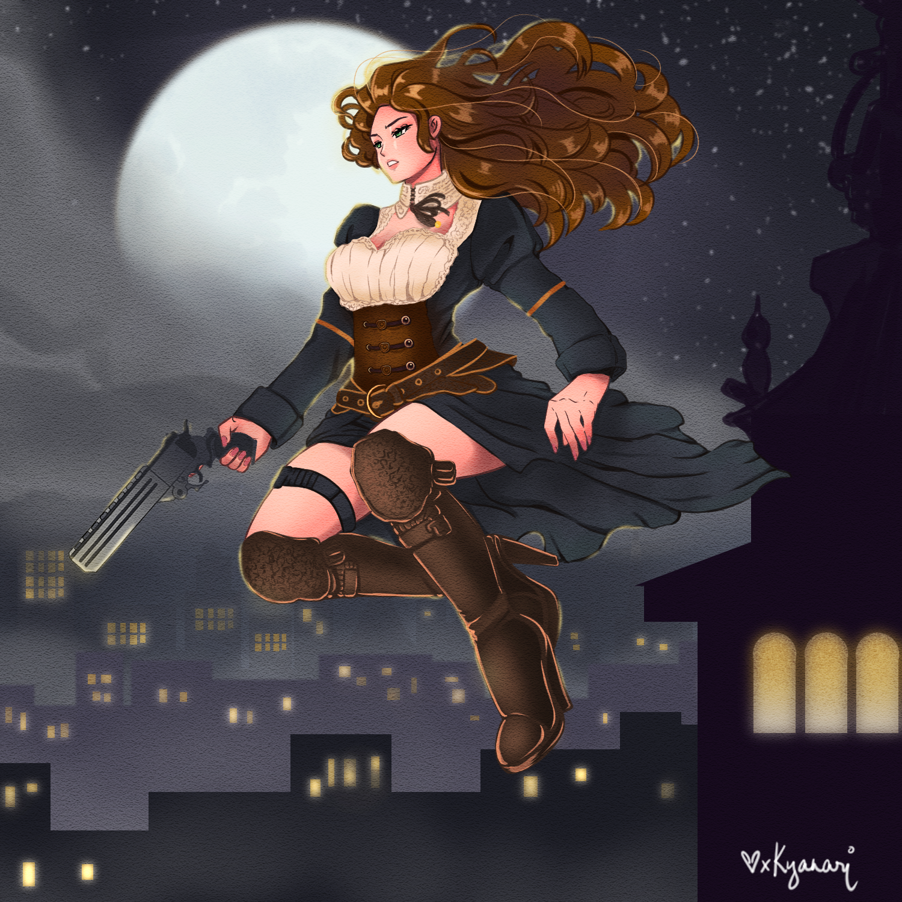

# 📪 About Dahlia

<figure><figcaption></figcaption></figure>

## Origin

Cerberon first met Dahlia during the medieval period, and was struck by her intelligence and wit at such a young age. Later on, he named his portal project after her, calling it Project DAHLIA. The early prototypes of the system were designed to open and close portals, allowing Cerberon to enter different timelines and explore the mysteries of Eldelvain. As the project evolved, Cerberon added a battle system to protect himself from the dangers that he encountered in his travels. Project DAHLIA became a powerful tool for Cerberon, enabling him to traverse time and space in his quest for knowledge and understanding.

Project DAHLIA is an important aspect of the game's lore and history, providing a unique backstory for Cerberon and his adventures in Eldelvain. The system's evolution from a simple portal mechanism to a powerful battle tool reflects Cerberon's resourcefulness and ingenuity, and adds depth and complexity to the game's world-building.

**DAHLIA** stands for:

* Dimensional
* Anomaly and
* Holographic
* Location
* Interface
* Agent

## Dahlia as a Discord Bot

Dahlia is a highly sophisticated bot that runs on Discord, offering a range of utilities and functions for players of this text-based RPG. Players interact with Dahlia through slash commands, buttons, select menus, and other explicit Discord interactions. While Dahlia offers many utilities, her primary function is to serve as a storyteller for the game, providing players with an immersive and engaging experience.

Players can participate through Discord without linking an external collection. By using Dahlia's commands, they can progress through the game, uncover its mysteries, and engage with other members of the community.

Dahlia does not require Discord's privileged Message Content, Server Members, or Presence gateway intents. This means she does not scan normal channel conversations, presence/activity status, or the full server member list.

#### List of Discord bot features:

* Verification with Captcha
* Giveaways
* Raffles
* Announcements
* Mini games
* Server setup logs
* Reaction roles
* Forms
* Storytelling
* Creating and closing private channels
* Creating, modifying, deleting sub-guilds (channels)
* Scheduling events
* Ticketing system
* Whitelisting
* Sales tracking

All of these may not require having administrator role on the bot for security, but they are subject to change without prior notice.
